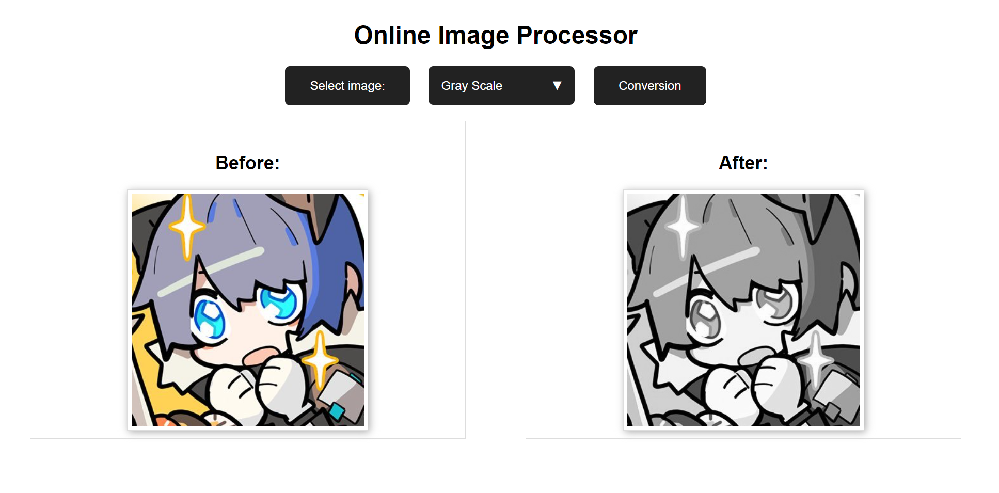

# Online Image Processor



Online Image Processing Tool is a web-based application that allows users to easily process and transform their images using a variety of effects and conversions.

## Features

- **Gray Scale Conversion**: Convert your image to grayscale.
- **Binarisation**: Convert your image to binary format.
- **Edge Enhancement**: Enhance the edges of your image.
- **Edge Detection**: Detect and highlight the edges within an image.
- **Noise Reduction**: Reduce noise from your image for a clearer appearance.

## Setup

### Prerequisites

- PHP (Version 8.2.2 recommended): Ensure that your PHP setup has the GD library installed, as this project utilizes it for image processing tasks. This project was built using PHP 8.2.2 with Zend Engine v4.2.2.
- 
### Installation

1. Clone the repository to your local machine or server:
   ```bash
   git clone https://github.com/rxxuzi/online-image-processor.git
   ```

2. Navigate to the project directory:
   ```bash
   cd online-image-processor.git
   ```

3. Ensure your web server is set up to serve the project directory.

4. Open your browser and navigate to the project's URL.

## Usage

1. Visit the main page of the tool.
2. Select the desired image that you wish to process.
3. Choose an image processing option from the dropdown.
4. Click "**Conversion**" to process the image.
5. View the before and after images side by side for comparison.

## License

This project is licensed under the MIT License. See the [LICENCE](./LICENCE) file for details.
